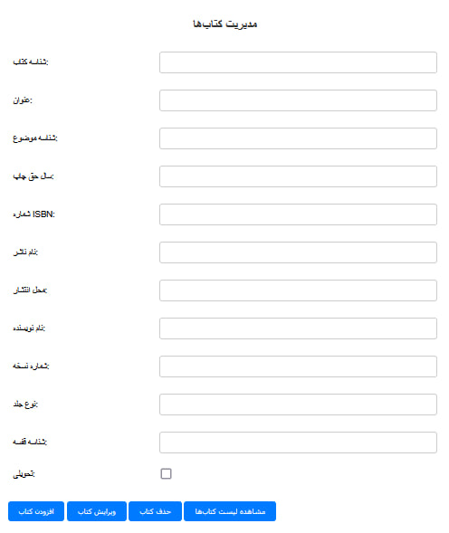

# KDB Book Manager – پروژه مدیریت کتاب ASP.NET WebForms

## معرفی پروژه KDB Book Manager

KDB Book Manager یک **اپلیکیشن وب توسعه یافته با ASP.NET WebForms** است که به شما امکان مدیریت کامل کتاب‌ها را می‌دهد. با این برنامه می‌توانید کتاب‌های جدید اضافه کنید، کتاب‌های موجود را ویرایش کنید و یا حذف نمایید. این پروژه برای ایجاد یک **کتابخانه آنلاین** ساده و کاربردی طراحی شده است.

---

## ویژگی‌های کلیدی پروژه

- **رابط کاربری کاربرپسند** و ساده برای مدیریت آسان کتاب‌ها  
- پیاده‌سازی استاندارد با فریمورک ASP.NET WebForms  
- قابلیت افزودن، ویرایش، حذف و مشاهده کتاب‌ها  
- ساختار کد تمیز و قابل توسعه برای پروژه‌های آتی
- دارای دیتابیس sql server
---

## نصب و راه‌اندازی پروژه

برای اجرای پروژه مراحل زیر را دنبال کنید:

1. پروژه را با نرم‌افزار **Visual Studio** باز کنید.  
2. پایگاه داده را دریافت کرده 
3. تنظیمات اتصال به پایگاه داده را پیکربندی کنید.  
4. پروژه را اجرا کنید و از مدیریت کتاب‌ها لذت ببرید!

---

## تماس و پشتیبانی

اگر سوالی داشتید یا نیاز به راهنمایی داشتید، می‌توانید از بخش Issues در گیت‌هاب استفاده کنید یا با من در ارتباط باشید.
و یا در تلگرام به ایدی@Phixon_z3r پیام دهید(جهت دریافت دیتابیس پیغام دهید)
---

**امیدوارم از پروژه استفاده کنید و بازخوردهای شما را دریافت کنم!**

---

Noob Days

